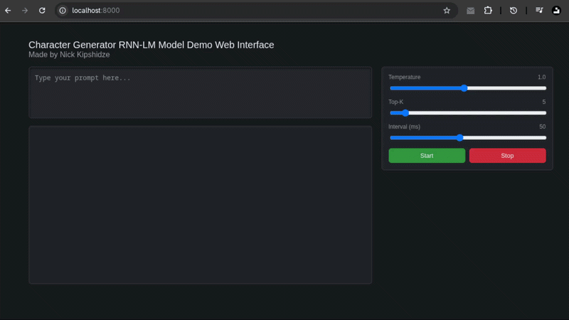

# Character-level RNN-LM model

This one is a tiny fun project I decided to build for fun. The goal of the project was to implement an embedding lookup table from-scratch, implement a basic unidirectional single-layer RNN from-scratch, and train it to predict the next character in a sequence.

The project was trained on a small filtered sample of the Wikipedia. The dataset sample was 21,823,060 characters in total, which I assumed was good enough size to train a small language model. The dataset is not included in the repository, it can easily be replaced by any other corpus of text, but the custom PyTorch dataset I wrote was intended for small corpora of text, hence the lack of actual data streaming. This was just a quick bare-bones implementation.

The model weights are here in the repository in [`RNNLM-T1-E16-H9-model.pth`](./RNNLM-T1-E16-H9-model.pth). I trained it overnight for 16 epochs, 9 hours wall-clock time.

Feel free to take a look at the code. The full training pipeline is in [`train.ipynb`](./train.ipynb), everything written and implemented by me, except the web interface, which I quickly generated using ChatGPT-4o-mini for the most part.